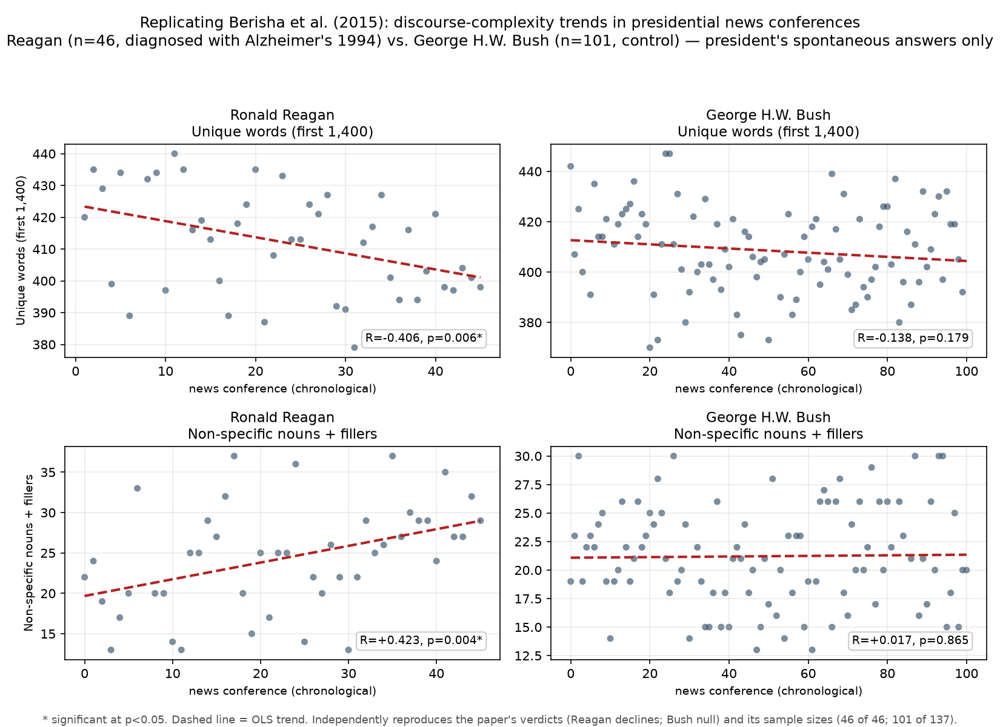

# Method validation: independently replicating Berisha et al. (2015)

**TL;DR.** Using an independently built corpus + pipeline, we reproduced the
published findings of Berisha et al. (2015) on presidential news-conference
language. **All six trend verdicts match** (Reagan's two Alzheimer's-associated
trends are significant in the same direction; the low-imageability-verb trend and
all three Bush control trends are null), and we independently recovered **both of
the paper's sample sizes** (46 of 46 Reagan conferences; 101 of 137 Bush). This
validates our collection → segmentation → feature-extraction → statistics chain
against peer-reviewed work before we extend it.



*Reagan (left) shows a significant decline in unique words and a significant rise
in non-specific nouns + fillers across his presidency; Bush (right, control) shows
neither. Points are individual news conferences in chronological order; dashed
line is the OLS trend. Compare to Figure 1 of the paper.*

## The original finding

Berisha, Wang, LaCross & Liss (2015) analyzed the spontaneous (unscripted)
portions of presidential news conferences and found that **Ronald Reagan** —
diagnosed with Alzheimer's disease in 1994 — showed a statistically significant
*decline in unique words* and *rise in non-specific nouns and conversational
fillers* over his two terms, detectable years before diagnosis. **George H.W.
Bush** (no known diagnosis) showed no such trends. The markers are established
correlates of cognitive decline in the dementia literature.

> Berisha V, Wang S, LaCross A, Liss J. "Tracking Discourse Complexity Preceding
> Alzheimer's Disease Diagnosis: A Case Study Comparing the Press Conferences of
> Presidents Ronald Reagan and George Herbert Walker Bush." *J Alzheimers Dis*
> 45(3):959–963 (2015). doi:10.3233/JAD-142763.

## Our results vs. the paper

**Ronald Reagan** (1981–1988, n=46) — diagnosed 1994:

| Feature | Our R | Our p | Published R | Published p | Verdict | Match |
|---|---:|---:|---:|---:|---|:---:|
| Unique words | −0.406 | 0.006 | −0.446 | 0.002 | significant decline | ✅ |
| Non-specific nouns + fillers | +0.423 | 0.004 | +0.358 | 0.017 | significant rise | ✅ |
| Low-imageability verbs | +0.055 | 0.731 | +0.032 | 0.835 | null | ✅ |

**George H.W. Bush** (1989–1992, n=101) — control:

| Feature | Our R | Our p | Published R | Published p | Verdict | Match |
|---|---:|---:|---:|---:|---|:---:|
| Unique words | −0.138 | 0.179 | −0.098 | 0.343 | null | ✅ |
| Non-specific nouns + fillers | +0.017 | 0.865 | +0.053 | 0.608 | null | ✅ |
| Low-imageability verbs | +0.042 | 0.682 | −0.099 | 0.333 | null | ✅ |

The exact coefficients differ slightly from the published ones — expected for an
independent reimplementation (different segmentation heuristics, tokenizer,
outlier edges) — but the **scientific verdict on every feature is identical**.
Two details fell out as exact, independent matches: of Reagan's news conferences,
**46 of 46** clear the 1,400-word threshold (as in the paper), and of Bush's,
**101 of 137** (as in the paper).

## Method (as reproduced)

1. **Source.** American Presidency Project news-conference transcripts,
   chronologically ordered.
2. **Segmentation.** Keep only the president's *spontaneous answers* — drop the
   prepared opening statement, all reporters' questions and other speakers, the
   editorial topic headers, and bracketed stage directions (`[Laughter]`).
3. **Length control.** Restrict to the first 1,400 words; keep only transcripts
   that reach 1,400 (the paper's threshold).
4. **Features.** Per transcript: unique words (Lancaster-stemmed), non-specific
   nouns (contain "thing"), fillers `{well, so, basically, actually, literally,
   um, ah}`, low-imageability verbs.
5. **Statistics.** Drop per-feature >2 SD outliers, then Pearson-correlate each
   feature against chronological index.

## Caveats (in the interest of honesty)

- This is a **case study** (n=2 presidents), exactly as the original is — it is a
  methods validation, not new clinical evidence. Reagan's significant trends are
  consistent with his later diagnosis; they are not, on their own, a diagnosis.
- The low-imageability-verb list is an approximate light-verb set pending exact
  confirmation from Bird et al. (2000); it is null in both the original and our
  run, so it does not affect any verdict.
- Earlier (on an incomplete overnight scrape that truncated Bush at 1991) Bush's
  unique-word trend looked marginally significant; on his **complete** term it is
  null, matching the paper — a reminder that these longitudinal trends are
  sensitive to coverage of the full time span.

## Reproduce it

```bash
python scripts/replicate_berisha.py --president reagan bush41   # the numbers
python scripts/validation_figure.py                            # the figure
```

Implementation: `scripts/segment_speaker.py` (president-only segmentation),
`scripts/replicate_berisha.py` (features + statistics),
`scripts/validation_figure.py` (figure). Source paper:
`documents/nihms-1062581.pdf`.
